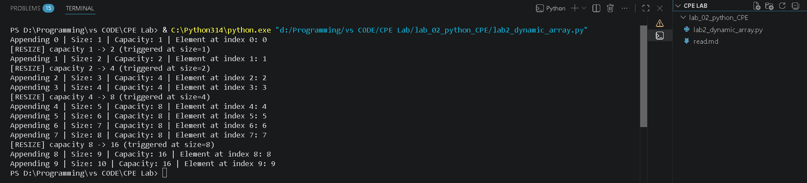

# Laboratory Activity No. 2 — Dynamic Array Builder & Capacity Allocation

## 1. Laboratory Information

| Field | Details |
|---|---|
| **Laboratory Title** | Dynamic Array Builder & Capacity Allocation |
| **Course Code** | CPEPRO8L |
| **Course Title** | Data Structures and Algorithms Laboratory |
| **Student Name** | Otiong, Cristan Jay N.
| **Date Completed** | 7/16/2026
| **Term** | First Semester, AY 2026–2027 |

---

## 2. Objectives

1. Implement a custom dynamic array class from scratch using Python's `ctypes` module.
2. Understand capacity scaling, memory doubling, and the cost of element copying.
3. Observe how index search works in **O(1)** constant time complexity.

---

## 3. Source Code

| File | Description |
|---|---|
| `lab2_dynamic_array.py` | Custom `DynamicArray` class implementing `__getitem__`, `append`, `_resize`, and `_make_array`, plus a driver script that appends 10 elements and traces capacity growth. |

Key design details:
- **Backing store:** a raw `ctypes.py_object` array (`_make_array`), not a Python `list`, to expose the manual memory-management step normally hidden by built-in containers.
- **Growth strategy:** capacity doubling (`2 * self.capacity`), triggered only when `size == capacity` — matching the amortized-growth strategy used internally by Python's `list` and C++'s `std::vector`.
- **Bounds checking:** `__getitem__` validates against the *logical* size (`self.size`), not the raw allocated `capacity`, so reads never return uninitialized/garbage slots.

---

## 4. Execution Results

### 4.1 Console Output

Command:
```bash
python lab2_dynamic_array.py
```

Output:
```
Appending 0 | Size: 1 | Capacity: 1 | Element at index 0: 0
[RESIZE] capacity 1 -> 2 (triggered at size=1)
Appending 1 | Size: 2 | Capacity: 2 | Element at index 1: 1
[RESIZE] capacity 2 -> 4 (triggered at size=2)
Appending 2 | Size: 3 | Capacity: 4 | Element at index 2: 2
Appending 3 | Size: 4 | Capacity: 4 | Element at index 3: 3
[RESIZE] capacity 4 -> 8 (triggered at size=4)
Appending 4 | Size: 5 | Capacity: 8 | Element at index 4: 4
Appending 5 | Size: 6 | Capacity: 8 | Element at index 5: 5
Appending 6 | Size: 7 | Capacity: 8 | Element at index 6: 6
Appending 7 | Size: 8 | Capacity: 8 | Element at index 7: 7
[RESIZE] capacity 8 -> 16 (triggered at size=8)
Appending 8 | Size: 9 | Capacity: 16 | Element at index 8: 8
Appending 9 | Size: 10 | Capacity: 16 | Element at index 9: 9
```

Program executed with no syntax or runtime errors.

### 4.2 Capacity Resize Trace Table

| Append # (i) | Size *before* append | Capacity *before* append | Resize Triggered? | New Capacity |
|:---:|:---:|:---:|:---:|:---:|
| 0 | 0 | 1 | No | 1 |
| 1 | 1 | 1 | **Yes** | 2 |
| 2 | 2 | 2 | **Yes** | 4 |
| 3 | 3 | 4 | No | 4 |
| 4 | 4 | 4 | **Yes** | 8 |
| 5 | 5 | 8 | No | 8 |
| 6 | 6 | 8 | No | 8 |
| 7 | 7 | 8 | No | 8 |
| 8 | 8 | 8 | **Yes** | 16 |
| 9 | 9 | 16 | No | 16 |

Resizes occurred exactly at logical sizes **1, 2, 4, and 8** — each time the array was completely full, confirming the capacity-doubling strategy.

### 4.3 Screenshots

*[]*

---

## 5. Analysis

**Q1: Run the script and record the exact sizes where capacity resizes occur.**

Resizing occurred at sizes **1, 2, 4, and 8** (see table above). This happened because the array starts at `capacity = 1`, and every time an append is attempted while `size == capacity`, `_resize` doubles the capacity before the write occurs. Since capacity doubles each time (1 → 2 → 4 → 8 → 16), resizes become progressively less frequent relative to the number of elements added — the array only had to resize 4 times to accommodate 10 appends, rather than resizing on every single insertion.

**Q2: Explain why the dynamic array copies elements during resize. What is the time complexity of a single resize operation?**

The array is backed by a `ctypes` block — a single contiguous, *fixed-size* region of memory allocated up front. Unlike a linked structure, this block cannot be "stretched" in place, because there is no guarantee that free memory exists immediately adjacent to it. When capacity is exceeded, the only option is to allocate an entirely new, larger contiguous block elsewhere in memory and manually copy every existing element from the old block into the new one, element by element, before the old block is discarded.

A single resize operation that copies `n` existing elements is therefore **O(n)** — a full linear pass over the array. However, because resizes only happen at exponentially spaced points (capacity doubling means the total copying work across all resizes forms a geometric series that sums to O(n) over `n` total appends), the *amortized* cost of a single `append` call remains **O(1)** on average, even though any individual append that triggers a resize costs O(n) in that instant.

---

## 6. Conclusion

This laboratory activity demonstrated how high-level, seemingly "free" operations like `list.append()` in Python are, under the hood, backed by careful memory management. By implementing a `DynamicArray` manually with `ctypes`, I observed firsthand how capacity doubling balances the trade-off between wasted memory (over-allocating) and the cost of frequent reallocation (under-allocating).

**Concepts learned:**
- The distinction between an array's *logical size* and its *physical capacity*.
- Why contiguous memory structures require full reallocation and copying to grow, unlike node-based structures such as linked lists.
- The concept of **amortized time complexity**, where an occasional O(n) operation is "smoothed out" over many O(1) operations to yield an average O(1) cost per call.

**Skills developed:**
- Low-level memory manipulation in Python using the `ctypes` module.
- Implementing core dunder methods (`__len__`, `__getitem__`) to make a custom class behave like a native container.
- Debugging subtle ordering bugs in resource-management code (see note below).

**Importance of the topic:**
Understanding dynamic array internals is foundational to reasoning about the real-world performance of data structures used every day — from Python lists to C++ vectors to Java ArrayLists. It also explains *why* certain operations (like inserting at the front of a list) are expensive, motivating the study of alternative structures such as linked lists in later laboratories.

> **Debugging note:** During implementation, care was taken to check `size == capacity` **before** writing the new element into the backing array, rather than after. Writing first and checking afterward would attempt to write one slot past the allocated `ctypes` buffer on the exact append that should trigger a resize, since `self.size` still equals `self.capacity` at that point. This ordering bug is easy to introduce and produces confusing, non-Pythonic errors from `ctypes` rather than a clean `IndexError`, making it a good lesson in defensive resource-bounds checking.
